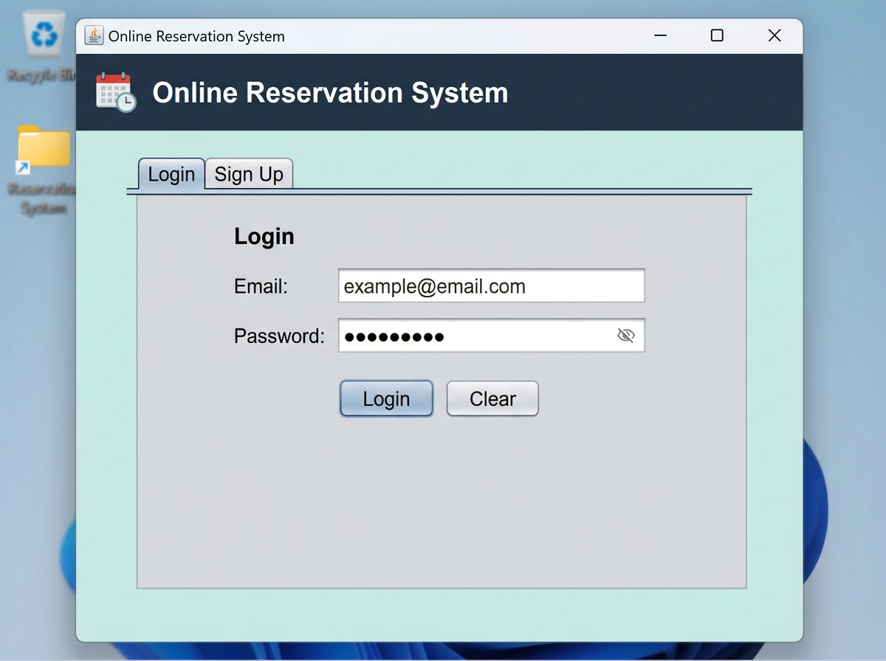
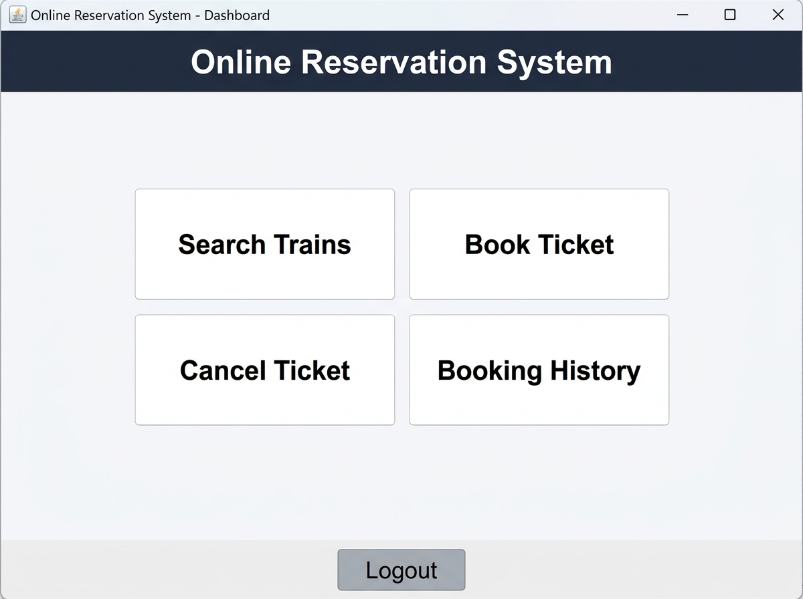
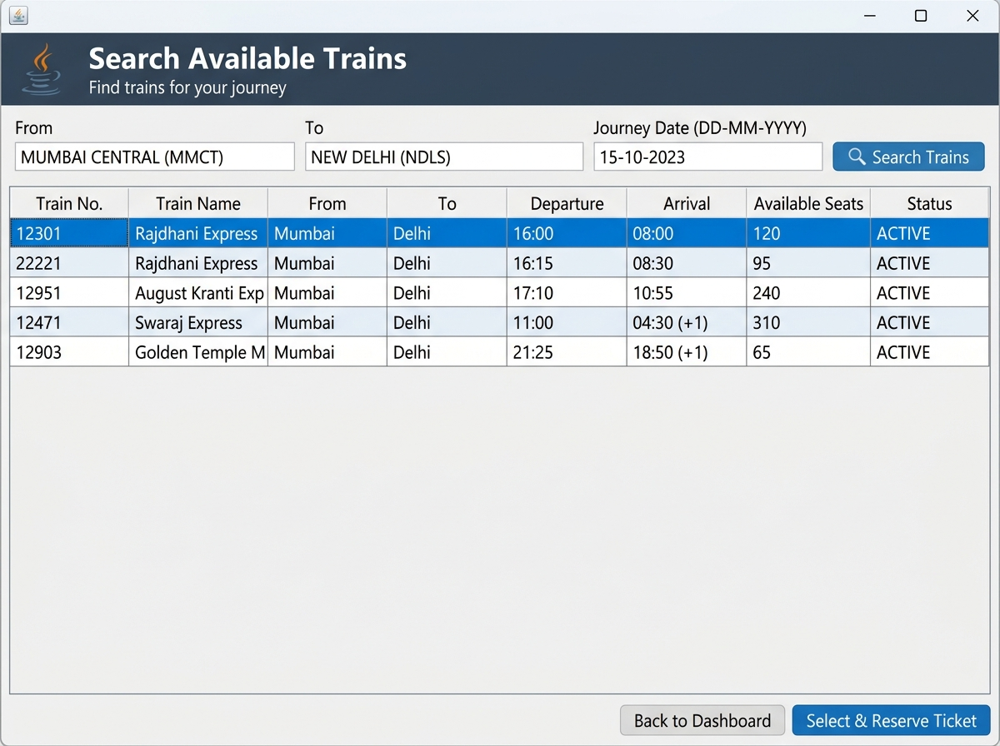
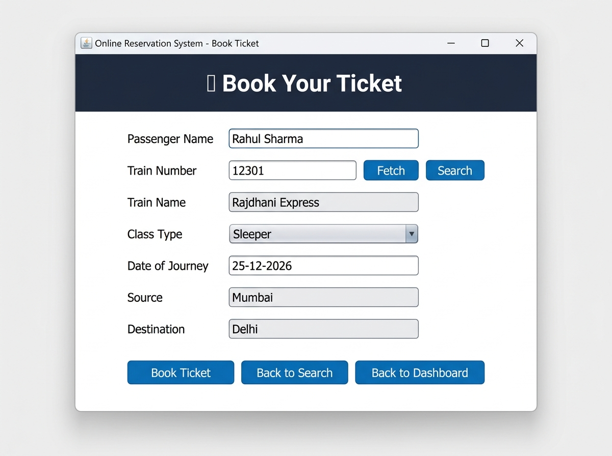
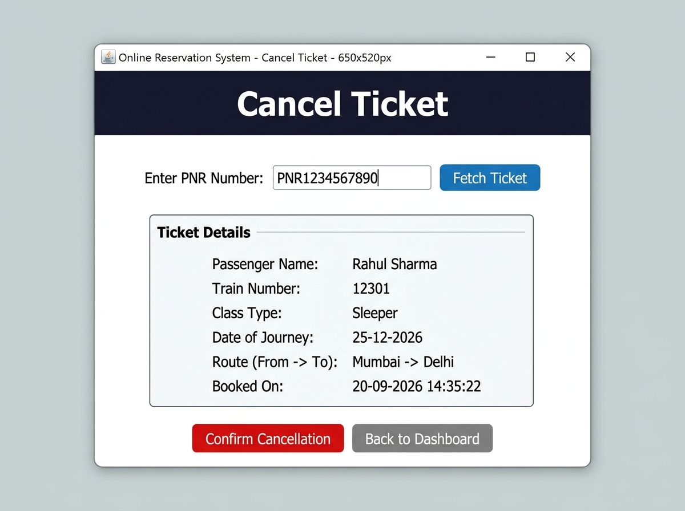

# 🚆 Online Reservation System

A **Java Swing desktop application** for managing train ticket reservations, built as Task 1 of the **Oasis Infobyte Java Development Internship (OIBSIP)**. The system features a full GUI with user authentication, train search, ticket booking, cancellation, and booking history — all backed by a MySQL database.

---

## 📸 Screenshots

| Login / Sign Up | Dashboard |
|:-:|:-:|
|  |  |

| Search Trains | Book Ticket |
|:-:|:-:|
|  |  |

| Cancel Ticket |
|:-:|
|  |

---

## ✨ Features

- 🔐 **User Authentication** – Secure login and sign-up with email/password validation
- 🔎 **Train Search** – Search available trains by source, destination, and journey date
- 🎫 **Ticket Booking** – Book tickets with auto-generated unique PNR numbers; supports 4 class types
- ❌ **Ticket Cancellation** – Cancel bookings by PNR; seats are returned to available inventory automatically
- 📋 **Booking History** – View all reservations; filter by PNR number or passenger name
- 🛡️ **Input Validation** – Date format checking, seat availability warnings, duplicate email prevention

---

## 🛠️ Tech Stack

| Layer | Technology |
|---|---|
| Language | Java (JDK 25) |
| UI Framework | Java Swing |
| Database | MySQL |
| JDBC Driver | MySQL Connector/J 9.6.0 |
| Build Tool | Apache Maven |

---

## 🗂️ Project Structure

```
src/main/java/com/vanshika/oibsip/reservation/
├── Main.java                          # Entry point
├── model/
│   ├── User.java                      # User entity
│   ├── Train.java                     # Train entity
│   └── Reservation.java               # Reservation entity
├── dao/
│   ├── UserDAO.java                   # User DB operations
│   ├── TrainDAO.java                  # Train DB operations
│   └── ReservationDAO.java            # Reservation DB operations
├── service/
│   ├── UserService.java               # User business logic
│   ├── TrainService.java              # Train business logic
│   └── ReservationService.java        # Reservation business logic
├── ui/
│   ├── LoginFrame.java                # Login & Sign Up screen
│   ├── DashboardFrame.java            # Main dashboard
│   ├── TrainSearchFrame.java          # Train search with results table
│   ├── ReservationFrame.java          # Ticket booking form
│   ├── CancellationFrame.java         # Ticket cancellation screen
│   └── HistoryFrame.java              # Booking history viewer
└── util/
    ├── DBConnection.java              # MySQL connection manager
    └── PNRGenerator.java              # Auto PNR number generator
```

---

## 🗄️ Database Setup

### 1. Create the Database

```sql
CREATE DATABASE online_reservation_system;
USE online_reservation_system;
```

### 2. Create Tables

```sql
-- Users table
CREATE TABLE users (
    user_id    INT AUTO_INCREMENT PRIMARY KEY,
    username   VARCHAR(100) NOT NULL,
    email      VARCHAR(150) NOT NULL UNIQUE,
    password   VARCHAR(255) NOT NULL,
    created_at TIMESTAMP DEFAULT CURRENT_TIMESTAMP
);

-- Trains table
CREATE TABLE trains (
    train_number        INT PRIMARY KEY,
    train_name          VARCHAR(150) NOT NULL,
    source_station      VARCHAR(100) NOT NULL,
    destination_station VARCHAR(100) NOT NULL,
    departure_time      VARCHAR(10),
    arrival_time        VARCHAR(10),
    available_seats     INT DEFAULT 0,
    status              VARCHAR(20) DEFAULT 'ACTIVE'
);

-- Reservations table
CREATE TABLE reservations (
    reservation_id      INT AUTO_INCREMENT PRIMARY KEY,
    pnr_number          VARCHAR(20) NOT NULL UNIQUE,
    passenger_name      VARCHAR(150) NOT NULL,
    train_number        INT NOT NULL,
    class_type          VARCHAR(50) NOT NULL,
    journey_date        DATE NOT NULL,
    source_station      VARCHAR(100) NOT NULL,
    destination_station VARCHAR(100) NOT NULL,
    booking_date        TIMESTAMP DEFAULT CURRENT_TIMESTAMP,
    FOREIGN KEY (train_number) REFERENCES trains(train_number)
);
```

### 3. Seed Sample Train Data

```sql
INSERT INTO trains VALUES
(12301, 'Rajdhani Express',       'Mumbai',    'Delhi',     '16:00', '08:00', 120, 'ACTIVE'),
(12951, 'August Kranti Express',  'Mumbai',    'Delhi',     '17:10', '10:55', 240, 'ACTIVE'),
(12431, 'Rajdhani Express',       'Chennai',   'Delhi',     '06:00', '10:00',  80, 'ACTIVE'),
(22691, 'Rajdhani Express',       'Bangalore', 'Delhi',     '20:00', '05:30', 100, 'ACTIVE');
```

---

## ⚙️ Configuration

### Option A: `db.properties` file *(recommended for local dev)*

Create `src/main/resources/db.properties`:

```properties
db.url=jdbc:mysql://localhost:3306/online_reservation_system
db.username=YOUR_MYSQL_USERNAME
db.password=YOUR_MYSQL_PASSWORD
```

> A template is available at `src/main/resources/db.properties.example`.

### Option B: Environment Variables *(recommended for deployment)*

```bash
export DB_URL=jdbc:mysql://localhost:3306/online_reservation_system
export DB_USERNAME=your_username
export DB_PASSWORD=your_password
```

Environment variables take priority over `db.properties` when both are set.

---

## 🚀 Getting Started

### Prerequisites

- Java JDK 25+
- Apache Maven 3.6+
- MySQL 8.0+

### Build & Run

```bash
# 1. Clone the repository
git clone https://github.com/YOUR_USERNAME/JavaDev-Task1-OnlineReservationSystem.git
cd JavaDev-Task1-OnlineReservationSystem

# 2. Set up the database (see Database Setup above)

# 3. Configure db.properties (see Configuration above)

# 4. Build the project
mvn clean package

# 5. Run the application
mvn exec:java -Dexec.mainClass="com.vanshika.oibsip.reservation.Main"
```

---

## 🧭 Application Flow

```
Login / Sign Up
      │
      ▼
  Dashboard
  ┌───┬───┬───┬───┐
  │   │   │   │   │
  ▼   ▼   ▼   ▼   
Search  Book  Cancel  History
Trains Ticket Ticket
  │     ▲
  └─────┘
  (Select & Reserve)
```

1. **Login/Sign Up** — Authenticate or create a new account
2. **Dashboard** — Choose from 4 main actions
3. **Search Trains** — Enter source, destination & date to find trains
4. **Book Ticket** — Select a train and fill in passenger details; receive a unique PNR
5. **Cancel Ticket** — Enter PNR to fetch and confirm cancellation
6. **Booking History** — Browse or search all reservations

---

## 📦 Class Types Supported

| Class | Description |
|---|---|
| Sleeper | General sleeper berths |
| AC 3 Tier | Air-conditioned 3-tier berths |
| AC 2 Tier | Air-conditioned 2-tier berths |
| AC First Class | Premium air-conditioned cabin |

---

## 🤝 Acknowledgements

Built as part of the **Oasis Infobyte Java Development Internship** — Task 1: Online Reservation System.

---

## 📄 License

This project is open source and available under the [MIT License](LICENSE).
