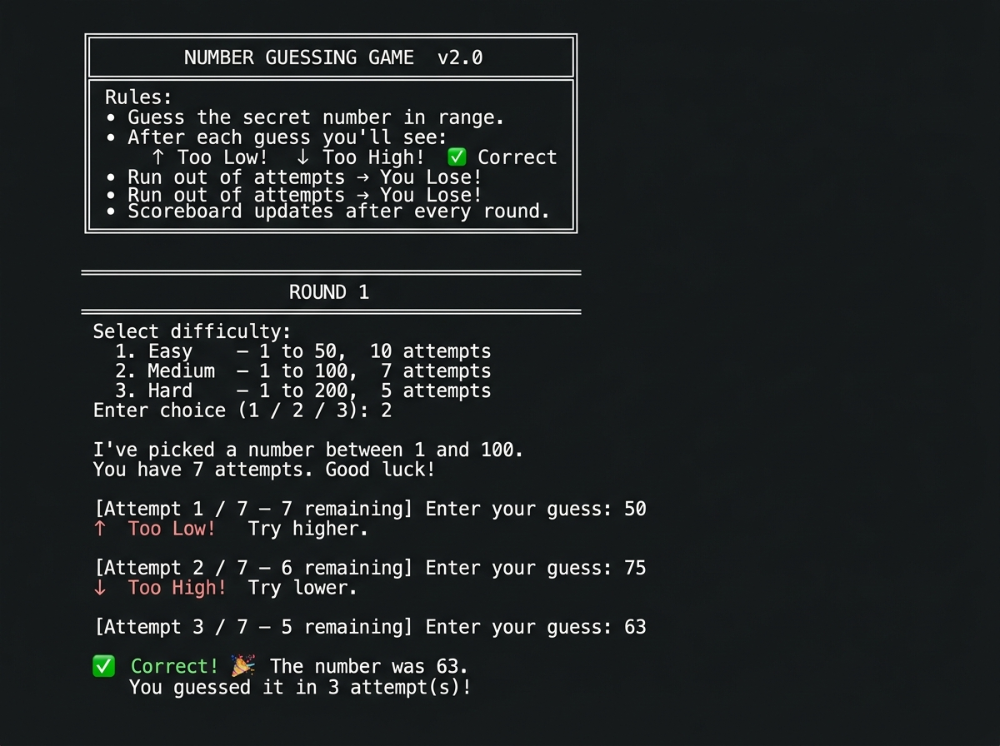

# 🎯 Number Guessing Game — Java Console Application

> **OIBSIP Java Development Internship · Task 2**

A feature-rich, interactive command-line Number Guessing Game built in Java. The player picks a difficulty level, then tries to guess a randomly generated secret number within a limited number of attempts. Hints after every guess and a running scoreboard keep each session engaging.

---

## 📸 Screenshot



---

## ✨ Features

| Feature | Details |
|---|---|
| 🎚️ **Three difficulty levels** | Easy (1–50, 10 attempts) · Medium (1–100, 7 attempts) · Hard (1–200, 5 attempts) |
| 💡 **Directional hints** | ↑ Too Low / ↓ Too High after every wrong guess |
| 🔄 **Multi-round play** | Play as many rounds as you like without restarting |
| 📊 **Live scoreboard** | Displayed after every round — shows difficulty, attempts used, and win/loss |
| 🛡️ **Robust input validation** | Rejects non-integers, out-of-range values, and invalid menu choices gracefully |
| 🎨 **ASCII UI** | Box-drawing characters for a clean, polished terminal look |

---

## 🗂️ Project Structure

```
JavaDev-Task2-NumberGussingGame/
├── NumberGuessingGame.java   # Main source file (all logic)
├── screenshots/
│   └── gameplay.jpg          # Sample gameplay output
└── README.md
```

### Key Classes / Enums

| Name | Type | Responsibility |
|---|---|---|
| `NumberGuessingGame` | `public class` | Entry point, game loop, I/O, scoreboard |
| `Difficulty` | `enum` | Encapsulates label, min/max range, and attempt limit per level |
| `RoundResult` | `class` | Immutable record of one completed round (stored in history list) |

---

## 🚀 How to Run

### Prerequisites
- **Java 8+** (JDK) installed and on your `PATH`

### Compile

```bash
javac NumberGuessingGame.java
```

### Run

```bash
java NumberGuessingGame
```

---

## 🕹️ How to Play

1. **Welcome banner** is shown on startup with the game rules.
2. **Select a difficulty** — enter `1`, `2`, or `3`.
3. **Guess the number** — type any integer within the displayed range and press Enter.
4. After each guess you'll see:
   - `↑  Too Low!`  — your guess is below the secret number
   - `↓  Too High!` — your guess is above the secret number
   - `✔  Correct! 🎉` — you win the round!
5. **Scoreboard** is printed after every round.
6. Choose **Y** to play another round or **N** to quit.

---

## 📊 Sample Scoreboard Output

```
┌─────────────────────────────────────────────────┐
│                    SCOREBOARD                   │
├────────┬──────────┬─────────────┬───────────────┤
│ Round  │ Diff     │ Attempts    │ Result        │
├────────┼──────────┼─────────────┼───────────────┤
│ 1      │ Medium   │  3 / 7      │ ✔ Won         │
│ 2      │ Hard     │  5 / 5      │ ✘ Lost (147)  │
│ 3      │ Easy     │  4 / 10     │ ✔ Won         │
└────────┴──────────┴─────────────┴───────────────┘
  Total: 3 round(s) played — 2 win(s), 1 loss(es)
```

---

## 🧠 Implementation Highlights

- **Single-file design** — all code lives in `NumberGuessingGame.java` for simplicity.
- **Fair randomisation** — the secret number is generated **once** at the start of each round and never changes.
- **`readInt(min, max)`** — a reusable safe-input helper that loops until a valid integer in range is provided, discarding bad tokens without crashing.
- **`RoundResult` list** — results are accumulated in an `ArrayList` so the scoreboard always reflects the full session history.

---

## 👩‍💻 Author

**Vanshika Poswal**
OIBSIP Java Development Internship — Task 2

---

## 📄 License

This project is open-source and available under the [MIT License](https://opensource.org/licenses/MIT).
